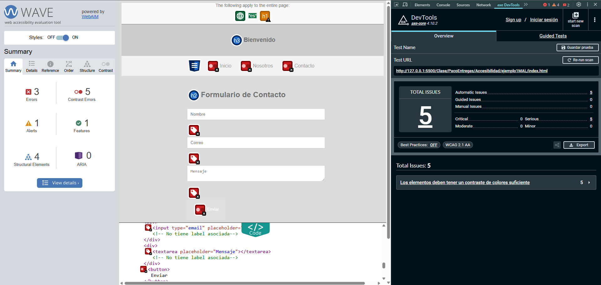
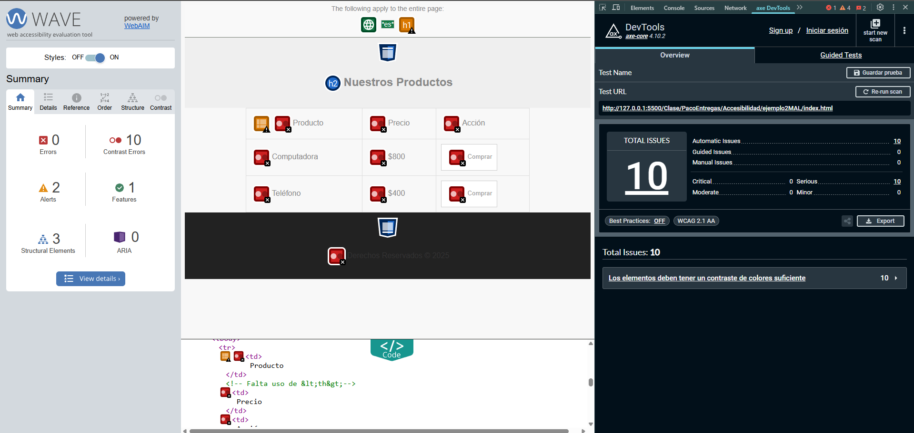
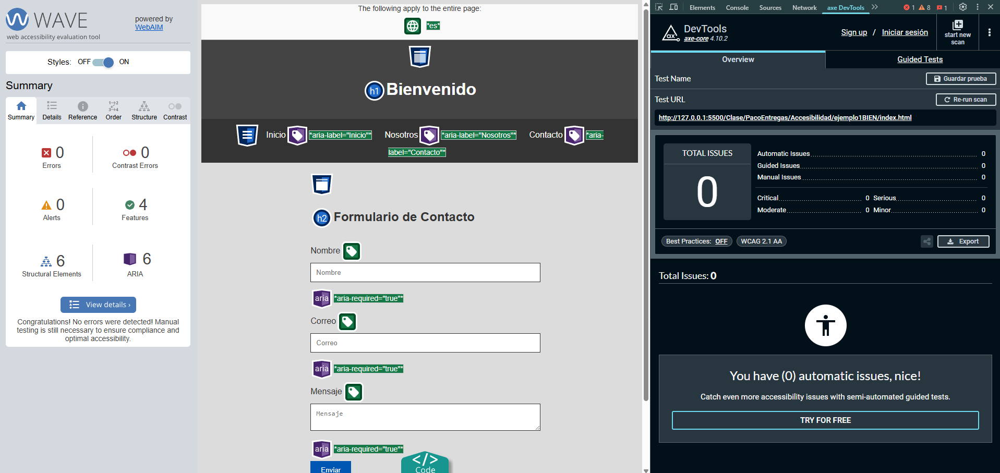
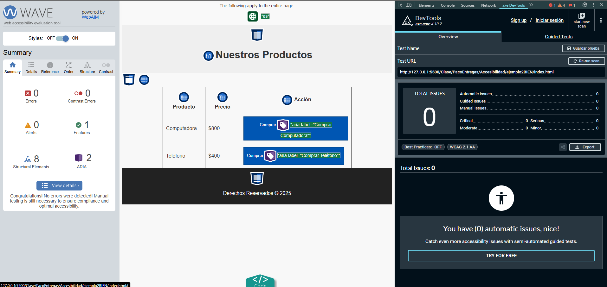

# Accesibilidad

---
## 📷 Capturas de Pantalla mala accesibilidad
| Ejemplo 1 | Ejemplo 2 |
|----------------------|------------------|
|  |  |

---

## Ejemplo 1: Formulario de Contacto (Codigo con errores)
```html
<!DOCTYPE html>
<html lang="es">
<head>
    <meta charset="UTF-8">
    <meta name="viewport" content="width=device-width, initial-scale=1.0">
    <title>Formulario de Contacto</title>
    <link rel="stylesheet" href="style.css">
</head>
<body>

    <div class="header"> <!-- Falta de semántica -->
        <h3>Bienvenido</h3> <!-- No debería ser un h3 sin un h1 antes -->
    </div>

    <nav> <!-- Mala visibilidad de enlaces -->
        <a href="#">Inicio</a>
        <a href="#">Nosotros</a>
        <a href="#">Contacto</a>
    </nav>

    <div class="content">
        <h2>Formulario de Contacto</h2>

        <form>
            <div>
                <input type="text" placeholder="Nombre"> <!-- No tiene label asociada -->
            </div>
            <div>
                <input type="email" placeholder="Correo"> <!-- No tiene label asociada -->
            </div>
            <div>
                <textarea placeholder="Mensaje"></textarea> <!-- No tiene label asociada -->
            </div>
            <button>Enviar</button> <!-- Falta descripción clara -->
        </form>
    </div>

    <footer>
        <p>© 2025 Todos los derechos reservados</p> <!-- Texto de bajo contraste -->
    </footer>

</body>
</html>
```
```css
body {
    background-color: #dcdcdc;
    color: #707070; /* Bajo contraste con el fondo */
    font-family: Arial, sans-serif;
}

.header {
    background-color: #ccc; /* Bajo contraste */
    text-align: center;
    padding: 10px;
}

nav {
    background-color: #f1f1f1;
    text-align: center;
    padding: 10px;
}

nav a {
    color: #a0a0a0; /* Bajo contraste con el fondo */
    text-decoration: none;
    margin: 0 10px;
}

.content {
    width: 50%;
    margin: auto;
    padding: 20px;
}

input, textarea {
    width: 100%;
    padding: 10px;
    margin-bottom: 10px;
    border: 1px solid #ccc; /* Bajo contraste */
}

button {
    background-color: #e0e0e0; /* Bajo contraste */
    color: #ffffff; /* Texto poco legible */
    border: none;
    padding: 10px 20px;
}

button:hover {
    background-color: #bbbbbb; /* Sigue teniendo poco contraste */
}

footer {
    background-color: #333;
    color: #444; /* Texto de bajo contraste */
    text-align: center;
    padding: 10px;
}

```
---

## Ejemplo 2: Lista de Productos (Codigo con errores)
```html
<!DOCTYPE html>
<html lang="es">
<head>
    <meta charset="UTF-8">
    <meta name="viewport" content="width=device-width, initial-scale=1.0">
    <title>Lista de Productos</title>
    <link rel="stylesheet" href="style.css">
</head>
<body>

    <header>
        <h2>Nuestros Productos</h2> <!-- Debería ser h1 -->
    </header>

    <table>
        <tr>
            <td>Producto</td> <!-- Falta uso de <th> -->
            <td>Precio</td>
            <td>Acción</td>
        </tr>
        <tr>
            <td>Computadora</td>
            <td>$800</td>
            <td><button>Comprar</button></td> <!-- Sin descripción para lectores de pantalla -->
        </tr>
        <tr>
            <td>Teléfono</td>
            <td>$400</td>
            <td><button>Comprar</button></td>
        </tr>
    </table>

    <footer>
        <p>Derechos Reservados &copy; 2025</p>
    </footer>

</body>
</html>

```
```css
body {
    background-color: #f8f8f8;
    color: #888; /* Texto de bajo contraste */
    font-family: Arial, sans-serif;
}

header {
    background-color: #efefef;
    text-align: center;
    padding: 10px;
}

table {
    width: 70%;
    margin: auto;
    border-collapse: collapse;
}

td {
    padding: 10px;
    border: 1px solid #ddd; /* Bajo contraste */
}

button {
    background-color: #ffffff; /* Se mezcla con el fondo */
    color: #999999; /* Bajo contraste */
    border: 1px solid #ccc;
    padding: 5px 10px;
}

footer {
    background-color: #222;
    color: #333; /* Texto casi ilegible */
    text-align: center;
    padding: 10px;
}

```
---
## 📷 Capturas de Pantalla mala accesibilidad
| Ejemplo 1 Bien | Ejemplo 2 Bien |
|----------------------|------------------|
|  |  |

---

## Ejemplo 1: Formulario de Contacto (corregido)
```html
<!DOCTYPE html>
<html lang="es">
<head>
    <meta charset="UTF-8">
    <meta name="viewport" content="width=device-width, initial-scale=1.0">
    <title>Formulario de Contacto</title>
    <link rel="stylesheet" href="style.css">
</head>
<body>

    <header>
        <h1>Bienvenido</h1>
    </header>

    <nav>
        <a href="#" aria-label="Inicio">Inicio</a>
        <a href="#" aria-label="Nosotros">Nosotros</a>
        <a href="#" aria-label="Contacto">Contacto</a>
    </nav>

    <main class="content">
        <h2>Formulario de Contacto</h2>

        <form>
            <div>
                <label for="nombre">Nombre</label>
                <input type="text" id="nombre" placeholder="Nombre" aria-required="true" required>
            </div>
            <div>
                <label for="correo">Correo</label>
                <input type="email" id="correo" placeholder="Correo" aria-required="true" required>
            </div>
            <div>
                <label for="mensaje">Mensaje</label>
                <textarea id="mensaje" placeholder="Mensaje" aria-required="true" required></textarea>
            </div>
            <button type="submit">Enviar</button>
        </form>
    </main>

    <footer>
        <p>© 2025 Todos los derechos reservados</p>
    </footer>

</body>
</html>
```
```css
body {
    background-color: #dcdcdc;
    color: #333333; /* Mejor contraste con el fondo */
    font-family: Arial, sans-serif;
}

header {
    background-color: #444444; /* Mejor contraste */
    text-align: center;
    padding: 10px;
    color: #ffffff;
}

nav {
    background-color: #333333; /* Mejor contraste */
    text-align: center;
    padding: 10px;
}

nav a {
    color: #ffffff; /* Mejor contraste con el fondo */
    text-decoration: none;
    margin: 0 10px;
}

nav a:focus, nav a:hover {
    outline: 2px solid #ffffff; /* Foco visible */
}

.content {
    width: 50%;
    margin: auto;
    padding: 20px;
}

input, textarea {
    width: 100%;
    padding: 10px;
    margin-bottom: 10px;
    border: 1px solid #333333; /* Mejor contraste */
}

button {
    background-color: #0056b3; /* Mejor contraste */
    color: #ffffff; /* Texto legible */
    border: none;
    padding: 10px 20px;
}

button:hover {
    background-color: #004494; /* Mejor contraste */
}

footer {
    background-color: #333333;
    color: #ffffff; /* Mejor contraste */
    text-align: center;
    padding: 10px;
}
```
---

## Ejemplo 2: Lista de Productos (Corregido)
```html
<!DOCTYPE html>
<html lang="es">
<head>
    <meta charset="UTF-8">
    <meta name="viewport" content="width=device-width, initial-scale=1.0">
    <title>Lista de Productos</title>
    <link rel="stylesheet" href="style.css">
</head>
<body>

    <header>
        <h1>Nuestros Productos</h1> <!-- Cambiado a h1 -->
    </header>

    <main>
        <table>
            <thead>
                <tr>
                    <th scope="col">Producto</th> <!-- Cambiado a th -->
                    <th scope="col">Precio</th>
                    <th scope="col">Acción</th>
                </tr>
            </thead>
            <tbody>
                <tr>
                    <td>Computadora</td>
                    <td>$800</td>
                    <td><button aria-label="Comprar Computadora">Comprar</button></td> <!-- Añadido aria-label -->
                </tr>
                <tr>
                    <td>Teléfono</td>
                    <td>$400</td>
                    <td><button aria-label="Comprar Teléfono">Comprar</button></td> <!-- Añadido aria-label -->
                </tr>
            </tbody>
        </table>
    </main>

    <footer>
        <p>Derechos Reservados &copy; 2025</p>
    </footer>

</body>
</html>

```

```css
body {
    background-color: #f8f8f8;
    color: #333; /* Mejor contraste */
    font-family: Arial, sans-serif;
}

header {
    background-color: #efefef;
    text-align: center;
    padding: 10px;
}

table {
    width: 70%;
    margin: auto;
    border-collapse: collapse;
}

th, td {
    padding: 10px;
    border: 1px solid #333; /* Mejor contraste */
}

button {
    background-color: #0056b3; /* Color distintivo */
    color: #ffffff; /* Mejor contraste */
    border: 1px solid #003f7f;
    padding: 5px 10px;
    cursor: pointer;
}

button:focus {
    outline: 2px solid #003f7f; /* Foco visible */
}

footer {
    background-color: #222;
    color: #ffffff; /* Mejor contraste */
    text-align: center;
    padding: 10px;
}
```
---
## Herramientas
Se ha usado las siguientes herramientas para validar la accesibilidad:
- WAVE Evaluation Tool (extension de chrome): https://chromewebstore.google.com/detail/jbbplnpkjmmeebjpijfedlgcdilocofh?utm_source=item-share-cb
- axe DevTools - Web Accessibility Testing (extension de chrome): https://chromewebstore.google.com/detail/lhdoppojpmngadmnindnejefpokejbdd?utm_source=item-share-cb
---

## Promp perfecto

Revisa y corrige este código HTML y CSS para garantizar que cumpla con los estándares WCAG 2.1 (niveles A, AA y AAA). Enfócate especialmente en resolver errores de contraste: asegúrate de que el ratio entre el texto y el fondo sea al menos 4.5:1 para texto normal y 3:1 para texto grande. Si encuentras contraste insuficiente (por ejemplo, texto blanco #ffffff sobre fondo azul #007bff), ajusta los colores en el CSS: oscurece el fondo (por ejemplo, #0056b3) o aclara el texto (por ejemplo, #e0e0e0). No ignores ningún error de contraste.

Además:

- Agrega atributos ARIA (aria-label, aria-describedby, role) donde sea necesario.
- Mejora la semántica con etiquetas HTML5 (<header>, <main>, <section>, etc.).
- Asegúrate de que las imágenes tengan alt descriptivo o alt="" si son decorativas.
- Verifica la jerarquía de encabezados (\<h1>, \<h2>, etc).
- Haz que elementos interactivos (enlaces, botones, formularios) sean accesibles por teclado y tengan foco visible.
- En formularios, asocia etiquetas (<label>) y marca campos obligatorios con aria-required o required.
- Asegúrate de que el CSS no dependa solo del color para transmitir información.

Aplica estos cambios y devuelve el código HTML y CSS corregido.
